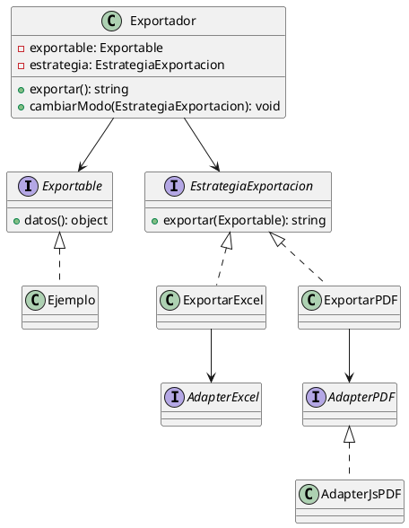

# exportador-js
Modulo exportador a PDF y Excel a partir de texto js

```plantuml
@startuml
interface Exportable{
+datos(): object
}

class Ejemplo{

}

class Exportador{
-exportable: Exportable
-estrategia: EstrategiaExportacion
+exportar(): string
+cambiarModo(EstrategiaExportacion): void
}

interface EstrategiaExportacion{
+exportar(Exportable): string

}

class ExportarExcel{

}

class ExportarPDF{

}

interface AdapterPDF{

}

interface AdapterExcel{

}

class AdapterJsPDF{

}

Exportador --> EstrategiaExportacion
ExportarPDF .up.|> EstrategiaExportacion
ExportarExcel .up.|> EstrategiaExportacion
ExportarExcel --> AdapterExcel
ExportarPDF --> AdapterPDF
AdapterJsPDF .up.|> AdapterPDF
Ejemplo .up.|> Exportable
Exportador --> Exportable
@enduml
```
