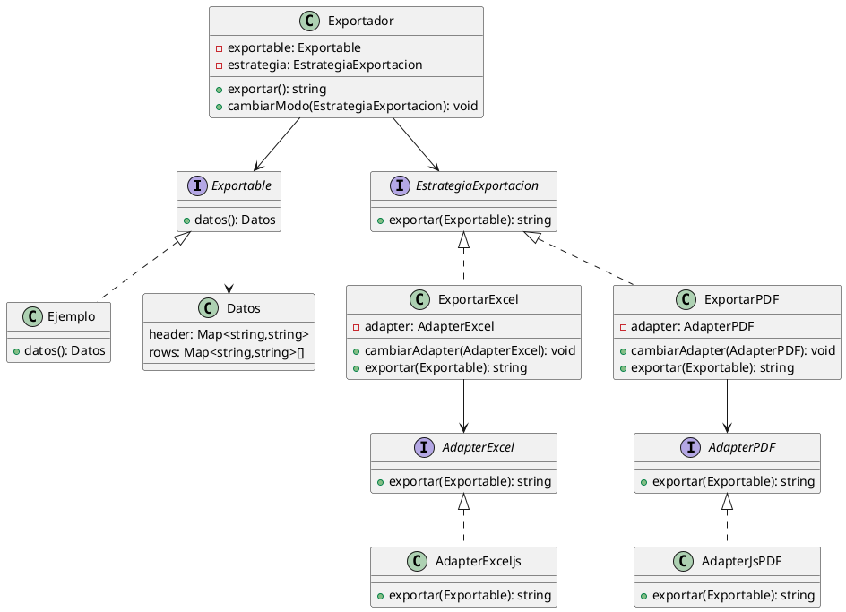

# exportador-js
Modulo exportador a PDF y Excel a partir de texto js

```plantuml
@startuml
interface Exportable{
+datos(): Datos
}

class Ejemplo{
+datos(): Datos
}

class Datos{
header: Map<string,string>
rows: Map<string,string>[]
}

class Exportador{
-exportable: Exportable
-estrategia: EstrategiaExportacion
+exportar(): string
+cambiarModo(EstrategiaExportacion): void
}

interface EstrategiaExportacion{
+exportar(Exportable): string

}

class ExportarExcel{
-adapter: AdapterExcel
+cambiarAdapter(AdapterExcel): void
+exportar(Exportable): string
}

class ExportarPDF{
-adapter: AdapterPDF
+cambiarAdapter(AdapterPDF): void
+exportar(Exportable): string
}

interface AdapterPDF{
+exportar(Exportable): string
}

interface AdapterExcel{
+exportar(Exportable): string
}

class AdapterJsPDF{
+exportar(Exportable): string
}

class AdapterExceljs{
+exportar(Exportable): string
}

Exportador --> EstrategiaExportacion
ExportarPDF .up.|> EstrategiaExportacion
ExportarExcel .up.|> EstrategiaExportacion
ExportarExcel --> AdapterExcel
ExportarPDF --> AdapterPDF
AdapterJsPDF .up.|> AdapterPDF
Ejemplo .up.|> Exportable
Exportador --> Exportable
Exportable ..> Datos
AdapterExceljs .up.|> AdapterExcel
@enduml
```

